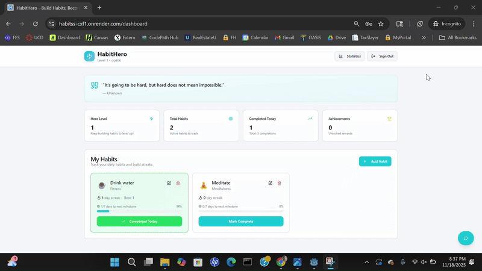
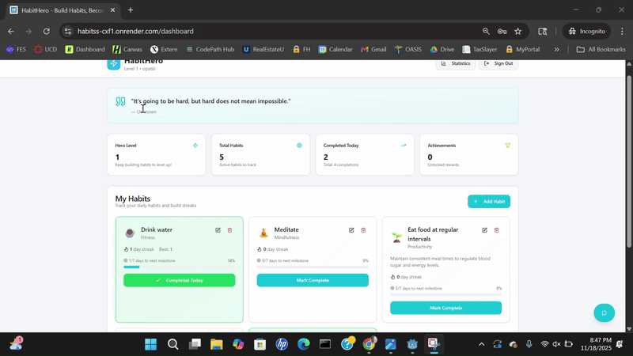
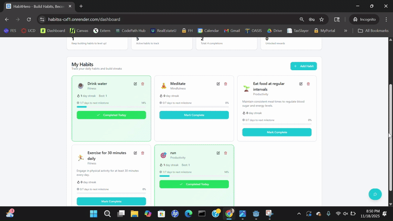
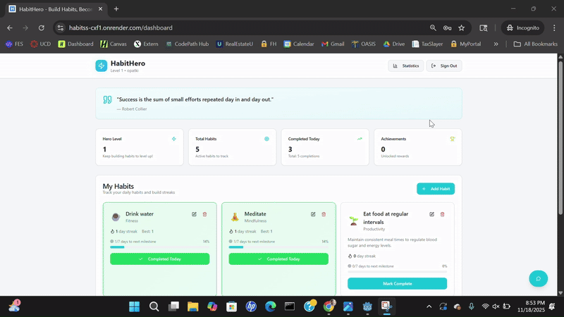
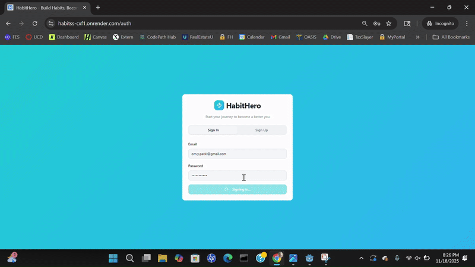
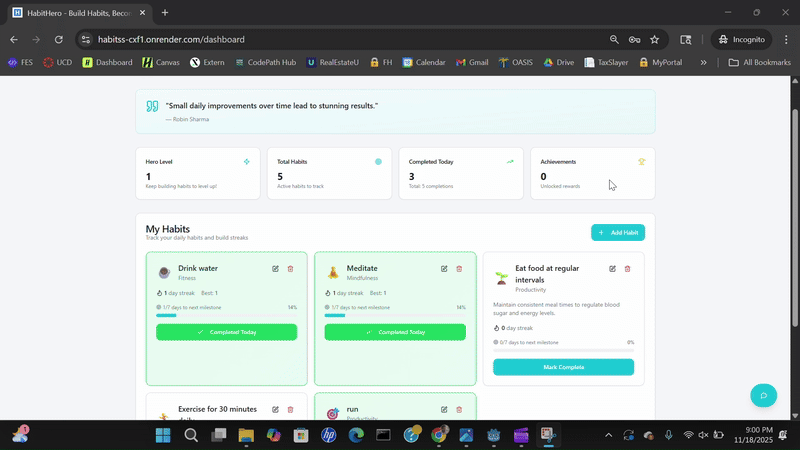
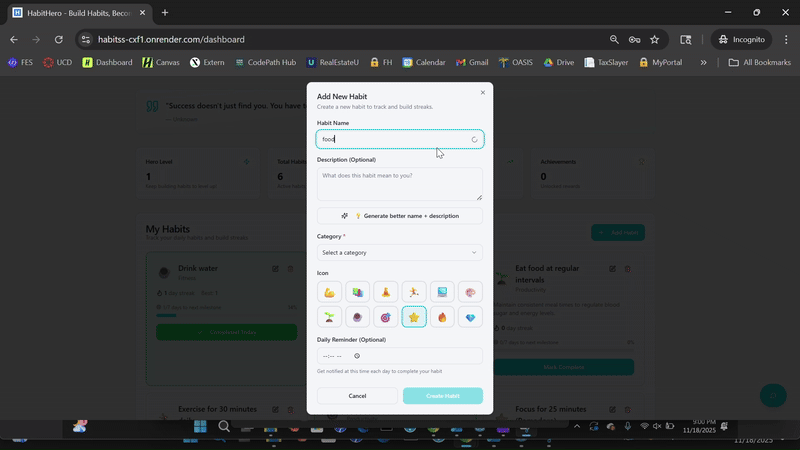
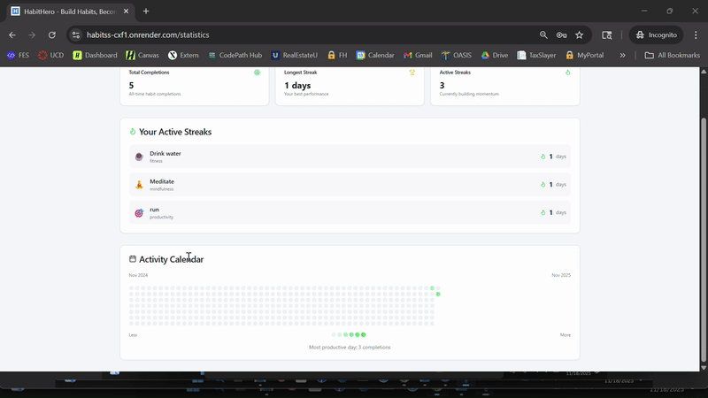

# 🦸‍♂️ HabitHero

### CodePath WEB103 Final Project

**Designed and developed by:**  
Ricardo Beale, Vitaliy Prymak, Om Patki

🔗 **Link to deployed app:** [HabitHero](https://habitss-cxf1.onrender.com)

---

## 🧩 About

### 📝 Description and Purpose
HabitHero is a fullstack web app that helps users build and track positive habits through small daily goals.  
Each completed habit helps the user’s “hero” grow stronger, motivating consistency and self-improvement.  
The app allows users to add, edit, and delete habits, view progress, and earn virtual achievements for streaks.

### 💡 Inspiration
We were inspired by apps like **Habitica** and **Duolingo** that combine productivity with fun.  
Many people struggle to stay consistent, so we wanted to create something that makes tracking habits more engaging — turning discipline into a game.

---

## ⚙️ Tech Stack
- **Frontend:** React, React Router, Tailwind CSS  
- **Backend:** Express.js, Node.js, PostgreSQL

---
## 🌟 Basic Features
### 🪪 Authentication ✅
Users will be able to create an account, log in, and securely access their personalized habit data.


### 🧠 Habit Dashboard with Habit Cards ✅
Users can view all their habits in one place with progress tracking and streak counts. Each habit will be displayed as a card showing its name, progress, category, and completion status, allowing users to easily track and manage their habits.


### ➕ Add / Edit / Delete Habits ✅
Users can create new habits, update them, or remove them easily from their dashboard.


---
## 🔥 Bonus (Stretch Features)

### 💬 Motivational Quotes ✅
Displays daily motivational quotes to encourage users and help maintain consistent habit-building momentum.


### 📊 Progress Bar and Streak Tracking ✅
Visual indicators show how close users are to completing each habit and how long they’ve kept a streak going, motivating them to continue.


### 🤖 AI Habit Coach Chatbot ✅
An AI-powered assistant that guides users, answers questions, and offers personalized habit-building tips or suggestions.


### ✍️ AI Mood Reflection and Journaling ✅
Allows users to log their mood and daily reflections. AI summarizes, analyzes patterns, and provides emotional or habit-based insights.


### ⚡ AI-Powered Autocomplete for Habit Names ✅
When users type a new habit, the system predicts and suggests common habit names to make creation faster and easier.


### 🎨 AI-Powered Habit Naming and Description Generator ✅
Generates creative, well-written habit names and descriptions based on user goals, helping them articulate habits more effectively.


### 🔥 Accountability Heatmap ✅
A visual heatmap showing activity levels over time, helping users see patterns in consistency and identify strong or weak periods in their habit-building journey.


---

## 💻 Installation Instructions

### 1. Clone the repository
```bash
git clone https://github.com/your-team/habithero.git
```
### 2. Install dependencies
```bash
cd habithero
npm install
cd client
npm install
```
### 3. Create and seed the PostgreSQL database
```bash
npm run db:reset
```
### 4. Run both servers
```bash
npm run dev
```
### 5. Open the app
- Visit: http://localhost:5173
