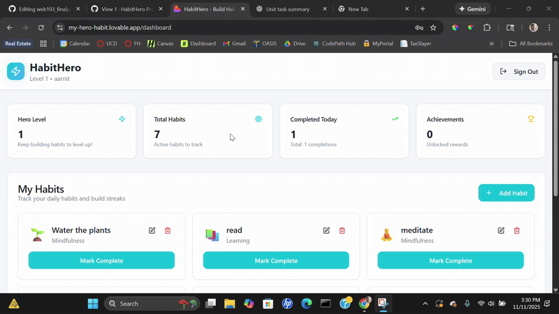

# Milestone 5

This document should be completed and submitted during **Unit 9** of this course. You **must** check off all completed tasks in this document in order to receive credit for your work.

## Checklist

This unit, be sure to complete all tasks listed below. To complete a task, place an `x` between the brackets.

- [X] Deploy your project on Render
  - [X] In `readme.md`, add the link to your deployed project
- [X] Update the status of issues in your project board as you complete them
- [X] In `readme.md`, check off the features you have completed in this unit by adding a ✅ emoji in front of their title
  - [X] Under each feature you have completed, **include a GIF** showing feature functionality
- [X] In this document, complete the **Reflection** section below
- [X] 🚩🚩🚩**Complete the Final Project Feature Checklist section below**, detailing each feature you completed in the project (ONLY include features you implemented, not features you planned)
- [ ] 🚩🚩🚩**Record a GIF showing a complete run-through of your app** that displays all the components included in the **Final Project Feature Checklist** below
  - [ ] Include this GIF in the **Final Demo GIF** section below

## Final Project Feature Checklist

Complete the checklist below detailing each baseline, custom, and stretch feature you completed in your project. This checklist will help graders look for each feature in the GIF you submit.

### Baseline Features

👉🏾👉🏾👉🏾 Check off each completed feature below.

- [X] The project includes an Express backend app and a React frontend app
- [X] The project includes these backend-specific features:
  - [X] At least one of each of the following database relationships in Postgres
    - [X] one-to-many
    - [X] many-to-many with a join table
  - [X] A well-designed RESTful API that:
    - [X] supports all four main request types for a single entity (ex. tasks in a to-do list app): GET, POST, PATCH, and DELETE
      - [X] the user can **view** items, such as tasks
      - [X] the user can **create** a new item, such as a task
      - [X] the user can **update** an existing item by changing some or all of its values, such as changing the title of task
      - [X] the user can **delete** an existing item, such as a task
    - [X] Routes follow proper naming conventions
  - [ ] The web app includes the ability to reset the database to its default state
- [ ] The project includes these frontend-specific features:
  - [ ] At least one redirection, where users are able to navigate to a new page with a new URL within the app
  - [X] At least one interaction that the user can initiate and complete on the same page without navigating to a new page
  - [X] Dynamic frontend routes created with React Router
  - [X] Hierarchically designed React components
    - [X] Components broken down into categories, including Page and Component types
    - [X] Corresponding container components and presenter components as appropriate
- [X] The project includes dynamic routes for both frontend and backend apps
- [X] The project is deployed on Render with all pages and features that are visible to the user are working as intended

### Custom Features

👉🏾👉🏾👉🏾 Check off each completed feature below.

- [ ] The project gracefully handles errors
- [X] The project includes a one-to-one database relationship
- [X] The project includes a slide-out pane or modal as appropriate for your use case that pops up and covers the page content without navigating away from the current page
- [ ] The project includes a unique field within the join table
- [ ] The project includes a custom non-RESTful route with corresponding controller actions
- [ ] The user can filter or sort items based on particular criteria as appropriate for your use case
- [ ] Data is automatically generated in response to a certain event or user action. Examples include generating a default inventory for a new user starting a game or creating a starter set of tasks for a user creating a new task app account
- [ ] Data submitted via a POST or PATCH request is validated before the database is updated (e.g. validating that an event is in the future before allowing a new event to be created)
  - [ ] *To receive full credit, please be sure to demonstrate in your walkthrough that for certain inputs, the item will NOT be successfully created or updated.*

### Stretch Features

👉🏾👉🏾👉🏾 Check off each completed feature below.

- [ ] A subset of pages require the user to log in before accessing the content
  - [ ] Users can log in and log out via GitHub OAuth with Passport.js
- [ ] Restrict available user options dynamically, such as restricting available purchases based on a user's currency
- [ ] Show a spinner while a page or page element is loading
- [ ] Disable buttons and inputs during the form submission process
- [ ] Disable buttons after they have been clicked
  - *At least 75% of buttons in your app must exhibit this behavior to receive full credit*
- [ ] Users can upload images to the app and have them be stored on a cloud service
  - *A user profile picture does **NOT** count for this rubric item **only if** the app also includes "Login via GitHub" functionality.*
  - *Adding a photo via a URL does **NOT** count for this rubric item (for example, if the user provides a URL with an image to attach it to the post).*
  - *Selecting a photo from a list of provided photos does **NOT** count for this rubric item.*
- [ ] 🍞 [Toast messages](https://www.patternfly.org/v3/pattern-library/communication/toast-notifications/index.html) deliver simple feedback in response to user events

## Final Demo GIF

## Reflection

### 1. What went well during this unit?
Our group communicated really well and divided responsibilities effectively. We were able to collaborate across the frontend and backend smoothly, and everyone contributed to shaping the final product. Once we aligned on the concept for HabitHero, the workflow felt natural and we made steady progress each week. Using tools like GitHub and pair programming helped us catch issues early and stay organized.

### 2. What were some challenges your group faced in this unit?
One of the main challenges was integrating the frontend with the backend, especially making sure our API routes, database schema, and React components all worked together without breaking. We also faced some bugs around state management and data persistence, which took time to debug. Scheduling work sessions around everyone’s availability was another challenge, but we eventually found ways to coordinate effectively.

### 3. What were some of the highlights or achievements that you are most proud of in this project?
I’m especially proud of how polished the final app feels. We built a fullstack project from scratch—React, Express, and PostgreSQL—which is a big milestone. Features like habit creation, editing, streak tracking, and the “hero growth” system turned out really well. It was also rewarding to deploy the app successfully and see everything working in a real-world environment. The fact that we combined functionality with a fun, game-like experience is something I’m proud of.

### 4. Reflecting on your web development journey so far, how have you grown since the beginning of the course?
Since the beginning of the course, I’ve grown a lot in terms of technical confidence and problem-solving skills. Early on, concepts like routing, state management, and fullstack architecture felt intimidating. Now, I can build a complete project that connects a database to an API and a frontend UI. I’ve also become much more comfortable reading documentation, debugging errors, and collaborating using Git/GitHub. Overall, I feel more like an actual developer rather than just following tutorials.

### 5. Looking ahead, what are your goals related to web development, and what steps do you plan to take to achieve them?
Going forward, I want to deepen my skills in fullstack development—especially strengthening my backend knowledge and learning more about authentication, optimization, and deployment. I also want to build more real projects to expand my portfolio. To reach these goals, I plan to continue practicing with personal projects, explore more advanced frameworks and tools, and seek feedback from developers who are more experienced. Ultimately, I want to keep improving so I can contribute to larger, more complex applications.
