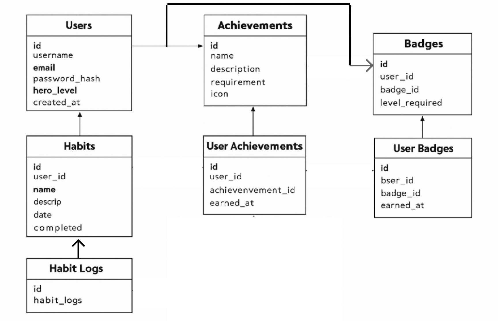

# Entity Relationship Diagram

Reference the Creating an Entity Relationship Diagram final project guide in the course portal for more information about how to complete this deliverable.

## Create the List of Tables
- users
- habits
- habit_logs
- achievements
- user_achievements
- badges
- user_badges

## Add the Entity Relationship Diagram

### 🧍‍♂️ Users Table
| Column Name   | Type                    | Description                                |
| ------------- | ----------------------- | ------------------------------------------ |
| id            | SERIAL PRIMARY KEY      | Unique user ID                             |
| username      | VARCHAR(50)             | User’s display name                        |
| email         | VARCHAR(100) UNIQUE     | User’s email                               |
| password_hash | TEXT                    | Hashed password                            |
| hero_level    | INTEGER DEFAULT 1       | Level of user’s hero based on achievements |
| created_at    | TIMESTAMP DEFAULT NOW() | Date the user registered                   |

### 📆 Habits Table
| Column Name  | Type                                           | Description                                        |
| ------------ | ---------------------------------------------- | -------------------------------------------------- |
| id           | SERIAL PRIMARY KEY                             | Unique habit ID                                    |
| user_id      | INTEGER REFERENCES users(id) ON DELETE CASCADE | The user who owns this habit                       |
| name         | VARCHAR(100)                                   | Habit name (e.g., “Drink Water”)                   |
| description  | TEXT                                           | Description of the habit                           |
| category     | VARCHAR(50)                                    | Habit category (Health, Learning, Mindset, etc.)   |
| frequency    | VARCHAR(20)                                    | How often the habit should be done (daily, weekly) |
| streak_count | INTEGER DEFAULT 0                              | Consecutive completion streak                      |
| created_at   | TIMESTAMP DEFAULT NOW()                        | When the habit was created                         |

### 📊 Habit Logs Table
| Column Name | Type                                            | Description                              |
| ----------- | ----------------------------------------------- | ---------------------------------------- |
| id          | SERIAL PRIMARY KEY                              | Unique log ID                            |
| habit_id    | INTEGER REFERENCES habits(id) ON DELETE CASCADE | Linked habit                             |
| date        | DATE                                            | Date for the tracked habit               |
| completed   | BOOLEAN DEFAULT FALSE                           | Whether the habit was completed that day |

### 🏆 Achievements Table
| Column Name | Type               | Description                             |
| ----------- | ------------------ | --------------------------------------- |
| id          | SERIAL PRIMARY KEY | Unique achievement ID                   |
| name        | VARCHAR(100)       | Achievement name (e.g., “7-Day Streak”) |
| description | TEXT               | What the achievement represents         |
| requirement | TEXT               | Criteria to earn this achievement       |
| icon        | TEXT               | Icon or image for display               |

### 🏅 User Achievements Table
| Column Name    | Type                                                  | Description                      |
| -------------- | ----------------------------------------------------- | -------------------------------- |
| id             | SERIAL PRIMARY KEY                                    | Unique record ID                 |
| user_id        | INTEGER REFERENCES users(id) ON DELETE CASCADE        | User who earned this achievement |
| achievement_id | INTEGER REFERENCES achievements(id) ON DELETE CASCADE | Linked achievement               |
| earned_at      | TIMESTAMP DEFAULT NOW()                               | When it was unlocked             |

### 🎖️ Badges Table
| Column Name    | Type               | Description                              |
| -------------- | ------------------ | ---------------------------------------- |
| id             | SERIAL PRIMARY KEY | Unique badge ID                          |
| name           | VARCHAR(100)       | Badge name (e.g., “Consistency Star”)    |
| description    | TEXT               | Description of the badge                 |
| icon           | TEXT               | Icon or color associated with badge      |
| level_required | INTEGER            | Minimum hero level or milestone required |

### 💫 User Badges Table
| Column Name | Type                                            | Description               |
| ----------- | ----------------------------------------------- | ------------------------- |
| id          | SERIAL PRIMARY KEY                              | Unique record ID          |
| user_id     | INTEGER REFERENCES users(id) ON DELETE CASCADE  | User who earned the badge |
| badge_id    | INTEGER REFERENCES badges(id) ON DELETE CASCADE | Badge earned by the user  |
| earned_at   | TIMESTAMP DEFAULT NOW()                         | Date the badge was earned |

